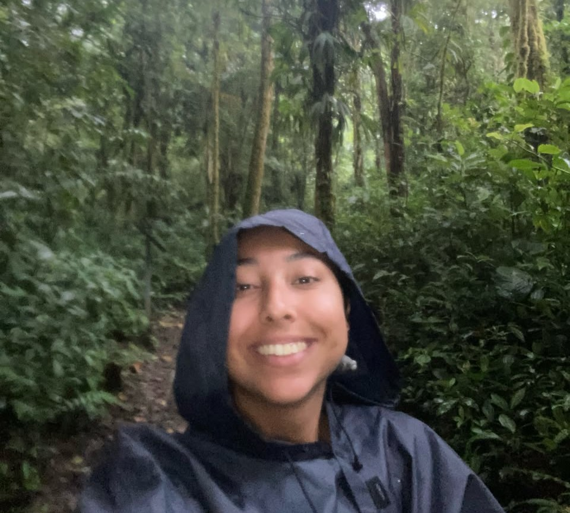

::: {.perfil-superior}

::: {.perfil-foto}

{fig-alt="Fotografía de perfil"}

:::

::: {.perfil-info}

# Dorene González

## Estudiante de Bachillerato en Biología Tropical

Escuela de Ciencias Biológicas  
Universidad Nacional, Costa Rica

::: {.enlaces-perfil}

[<i class="bi bi-envelope-fill"></i> Correo](mailto:dorene.gonzalez.gonzalez@est.una.ac.cr)

[<i class="bi bi-github"></i> GitHub](https://github.com/dorenegg)

[<i class="bi bi-person-badge-fill"></i> ORCID](https://orcid.org/0000-0002-3665-6541)

[<i class="bi bi-linkedin"></i> LinkedIn](https://linkedin.com/in/dorene-gonzález-gonzález-2116a1263)
:::

:::

:::

---

## Biografía

Escriba un breve párrafo (100–150 palabras) donde describa quién es, su formación académica, sus principales intereses científicos y sus metas profesionales.

---

## Áreas de interés

- Ecología
- Conservación
- Ecotoxicología
- Microalgas
- Calidad de aguas

---

## Habilidades

- R
- Git y GitHub
- QGIS
- Microsoft Office

---

## Formación académica

**Universidad Nacional (UNA)**

Bachillerato en Biología con éfasis en Tropical

*2022 – Presente*

**University of Veterinary Medicine Hannover (TiHo)**

Tropical Wildlife Biology Course - Costa Rica
