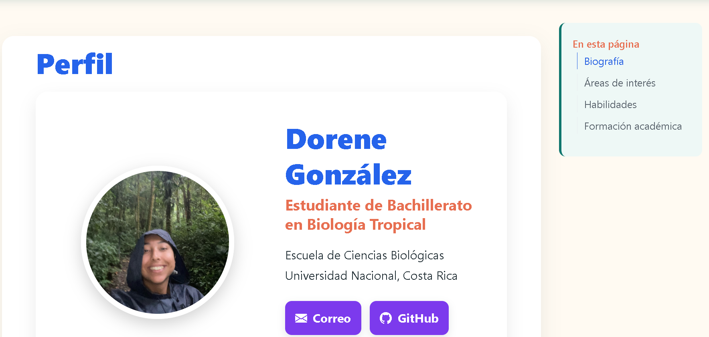

## Objetivo

Creación de un sitio web personalizado.

## Materiales y herramientas

- RStudio
- Quarto
- Git
- GitHub

## Procedimiento

Explique de forma ordenada los pasos realizados durante la práctica.

## Resultados

Creación exitosa de un sitio web

## Figuras y tablas

Agregue las figuras, tablas o capturas de pantalla necesarias para documentar el trabajo.

## Reflexión final

Responda brevemente:

- ¿Qué aprendí?
- ¿Qué dificultad encontré?
- ¿Cómo podría aplicar esta herramienta o conocimiento en otro contexto?
